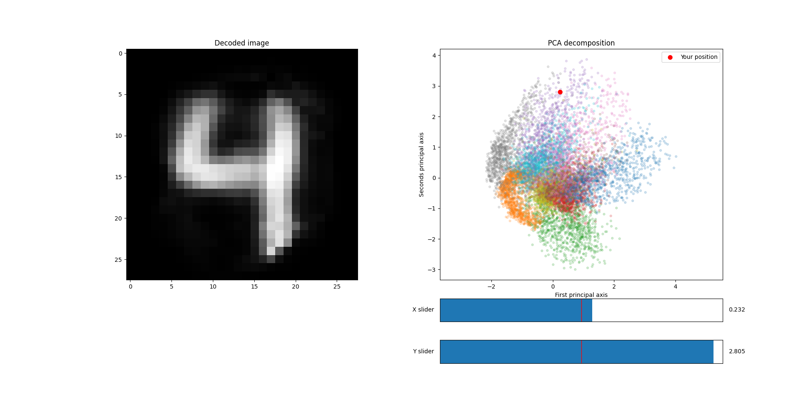

# MNIST-latent-exploration
 A small python file that let's you explore the four-dimensional embedding of the MNIST dataset.
 Just run `autoEncoder.py` and you'll be able to see the embedding of the MNIST dataset interactively. However, I've only made the first two principal components explorable.

Made for fun.